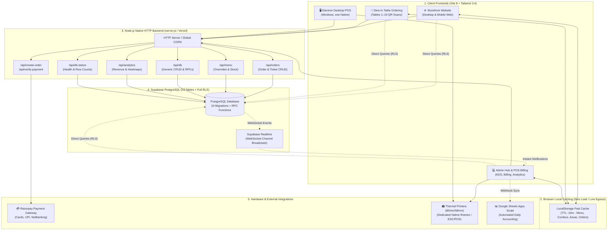
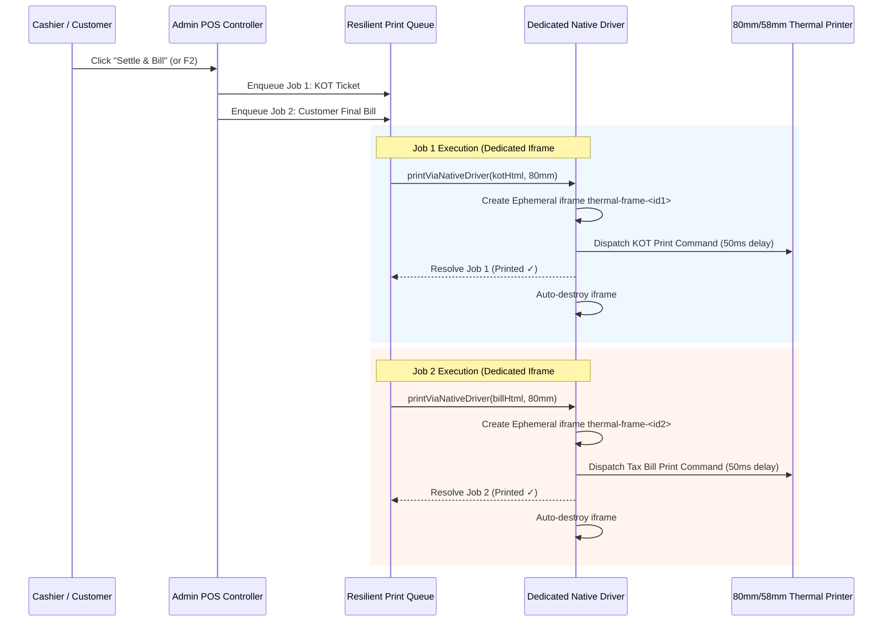

# 🍽️ LIMRA Restaurant — Enterprise Food Service, POS & E-Commerce Platform

[]()
[-indigo.svg)]()
[-3ECF8E.svg)]()
[]()
[]()
[-0B61A4.svg)]()
[]()
[]()

> **Owner / Operator:** SK Arif | LIMRA Restaurant, Egra, Purba Medinipur, West Bengal, India  
> **Database Host:** Supabase PostgreSQL (`https://ynrtlcasbndkrqeotgzt.supabase.co`)  
> **Desktop Client:** Electron 44 Native Windows POS Executable  
> **Mobile Client:** Capacitor Android PWA / Hybrid App  

---

## 📑 Table of Contents

1. [Executive Summary](#-executive-summary)
2. [End-to-End System Architecture](#-end-to-end-system-architecture)
3. [Component Connections & Data Flow](#-component-connections--data-flow)
4. [Core Portals & Operational Modules](#-core-portals--operational-modules)
   - [Customer Online Storefront (`frontend/index.html`)](#1-customer-online-storefront-frontendindexhtml)
   - [Dine-In Contactless Table Ordering (`frontend/table/index.html`)](#2-dine-in-contactless-table-ordering-frontendtableindexhtml)
   - [Admin Hub, POS Billing & KDS (`frontend/admin.html`)](#3-admin-hub-pos-billing--kds-frontendadminhtml)
   - [Stock & Inventory Management (`#panel-stock`)](#4-stock--inventory-management-admin-panel-stock)
   - [Electron Desktop Windows POS (`electron/`)](#5-electron-desktop-windows-pos-electron)
   - [Google Sheets Accounting Bridge (`tools/google-apps-script/`)](#6-google-sheets-accounting-bridge-toolsgoogle-apps-script)
5. [Item-Level GST, Billing & Calculations Engine](#-item-level-gst-billing--calculations-engine)
6. [Thermal Printing Pipeline (KOT + Final Bill)](#-thermal-printing-pipeline-kot--final-bill)
7. [Zero-Egress & High-Performance Caching Architecture](#-zero-egress--high-performance-caching-architecture)
8. [Project Directory Layout](#-project-directory-layout)
9. [REST API Reference (`/api/*`)](#-rest-api-reference-api)
10. [Database Schema & Stored Procedures (23 Tables + RPCs)](#-database-schema--stored-procedures-23-tables--rpcs)
11. [Environment Variables & Credentials](#-environment-variables--credentials)
12. [Installation, Setup & Local Development](#-installation-setup--local-development)
13. [Build, Packaging & Deployment](#-build-packaging--deployment)
14. [Recent Problem Resolutions & Changelog](#-recent-problem-resolutions--changelog)
15. [License & Proprietary Notice](#-license--proprietary-notice)

---

## 📖 Executive Summary

**LIMRA Restaurant Platform** is an enterprise-grade, omni-channel operating system and e-commerce platform purpose-built for high-volume modern restaurant operations. It unifies:

- **Customer-Facing Web Storefront**: Live delivery geofencing, real-time dish search, cart management, Razorpay payment processing, order tracking, and reservations.
- **Contactless Dine-In Table Ordering**: Table QR scanning (Tables 1–19 across indoor and outdoor zones), multi-round ordering (`place_table_round` RPC), and cross-selling pairing recommendations.
- **Admin POS & Billing Counter**: Walk-in billing, phone orders, hold orders, visual dish customization, table session settlement, and fast keyboard shortcuts (F1/F2).
- **Kitchen Order Display (KDS)**: Real-time ticket progression from pending to delivered.
- **Dual Thermal Printing Engine**: Synchronized KOT and customer tax invoice printing on 80mm/58mm thermal paper via browser driver or ESC/POS hardware.
- **Granular Item-Level GST Control**: Selective 5% GST calculation with dish-level toggles in Admin, separating taxable and tax-exempt items.
- **Inventory & Stock Manager**: Real-time ingredient tracking with 1-click presets and low-stock alerts.
- **Google Sheets Live Sync**: Instant cloud recording of sales and menu items for accounting and reconciliation.

---

## 🏛️ End-to-End System Architecture



---

## 🔗 Component Connections & Data Flow

### 1. Online Order Workflow (Delivery & Pickup)
1. **Menu Load**: Customer opens `frontend/index.html`. Base items load immediately from `frontend/src/data/menu.js` (202 dishes), overlaid with cached overrides from `localStorage` (`limra_fast_overrides`). Background request fetches live overrides and custom combos without UI blocking.
2. **Geofencing Verification**: When customer enters delivery area or drops map pin, Leaflet coordinates are validated against `delivery_areas` polygons. Standard flat-rate or distance-based fee (₹10/km) is calculated.
3. **Cart & GST Calculation**: Dishes are added to cart. GST is calculated at 5% **only on items where `gst_applicable !== false`**.
4. **Checkout & Payment**:
   - **Cash on Delivery (COD)**: Order is inserted directly into Supabase `orders` and `order_items` tables via RPC.
   - **Online Payment**: Frontend calls backend `POST /api/create-order` to generate a Razorpay order. Customer pays via Razorpay checkout modal. Frontend submits signature to `POST /api/verify-payment` for HMAC-SHA256 verification. Upon confirmation, order status updates to `confirmed` and `payment_status` to `paid`.
5. **Real-Time Notification**: Supabase triggers a Realtime event on `postgres_changes`. The Admin Hub immediately sounds an audio alert, pops an incoming order modal, and displays the ticket on the Kitchen Display.

### 2. Dine-In Contactless Table Workflow
1. **QR Scan**: Customer scans table QR code (e.g., `http://.../table/index.html?table=5`). Table number and zone (`indoor` for tables 1–9, `outdoor` for tables 10–19) are locked into the session.
2. **Tray Selection & Cross-Selling**: Customer adds items to tray. Alphanumeric IDs (`custom_17`, `combo-2`, standard integer IDs) are parsed without `NaN` issues. Real-time pairing engine surfaces recommended drinks and sides.
3. **Multi-Round Submission**: Clicking "Send to Kitchen" calls the atomic `place_table_round` RPC:
   - If an open ticket exists for the table, new items are appended as Round 2, Round 3, etc.
   - If no open ticket exists, a new session ticket (`ticket_status: OPEN`) is initialized.
4. **Kitchen Ticket**: KOT is generated and immediately sent to the kitchen printer.
5. **Service Signals**: Customers can click "Call Waiter" or "Request Bill", writing instant notification rows into the `notifications` table.

### 3. POS Billing & Settlement Workflow
1. **Order Assembly**: Staff picks dishes from the category pill grid, searches dishes with F1, or scans barcodes.
2. **Settlement (F2 or Click)**: Staff clicks **"Settle & Bill"**:
   - Order status becomes `delivered`, `payment_status` becomes `paid`, `ticket_status` becomes `CLOSED`.
   - **Both KOT + Final Tax Bill print automatically** (applicable for Table, Pickup, and Delivery orders).
   - Order automatically syncs to Google Sheets for ledger accounting.

---

## 🚀 Core Portals & Operational Modules

### 1. Customer Online Storefront (`frontend/index.html`)
- **Master 202-Dish Menu**: Loaded from [`frontend/src/data/menu.js`](file:///c:/MY_ALL_ITEM/my%20all%20app/E-COMMERSE%20LIMRA%20website/frontend/src/data/menu.js), dynamically merged with active custom dishes from `combos` and live pricing from `menu_overrides`.
- **Zomato/Swiggy-Style Search**: Real-time dropdown search with debouncing, fuzzy matching, category aliases, dietary indicators, and sold-out protection.
- **Sold-Out Protection**: Dishes marked out of stock display disabled "+ Sold Out" buttons; cart additions are strictly blocked with informative toast alerts.
- **Leaflet.js Geofencing**: Customer address and live GPS pins validated against defined delivery polygons in `delivery_areas`.
- **Dynamic Delivery Fees**: Pre-configured area rates or customized GPS distance calculations (`₹10/km`).
- **Reactive Antigravity Store**: LocalStorage-persisted cart state with coupon validation, minimum bill thresholds, and item-level GST segregation.
- **Internationalization (i18n)**: English (EN), Bengali (BN / বাংলা), Hindi (HI / हिंदी), and Odia (OD / ଓଡ଼ିଆ).
- **Table Reservation Engine**: Contactless booking modal connected to `bookings` table via `place_booking` RPC.

### 2. Dine-In Contactless Table Ordering (`frontend/table/index.html`)
- **Table-Side QR Ordering**: Dedicated sessions for Tables 1 to 19 across Indoor and Outdoor/Rooftop zones.
- **Multi-Round Accumulator**: Multiple food rounds placed under a single consolidated bill ticket (`place_table_round`).
- **Dynamic Cross-Selling**: Algorithmic item pairings recommending beverages and accompaniments based on current tray contents.
- **Product Detail Drawer**: Visual sliding drawer showing item details, strike-through MRP discounts, item descriptions, and stock status.
- **Digital Staff Call Buttons**: "Call Waiter" and "Request Bill" buttons routing immediate alerts to POS dashboards.
- **QR Code Admin Generator (`frontend/table/qr-admin.html`)**: Administrative portal to generate, preview, customize, and print high-resolution QR tokens for all dining tables.

### 3. Admin Hub, POS Billing & KDS (`frontend/admin.html`)
- **Cashier POS Counter**: High-speed touch interface with dish quick-select, item notes, custom prices, discount percentages, and payment allocation (Cash, UPI, Card).
- **Hold Orders System**: Hold in-progress orders, resume into POS cart, or visually modify items via the Hold Modal (`openHoldEditModal`).
- **Kitchen Order Display (KDS)**: Dedicated panel organizing orders into visual stages: *Pending*, *Confirmed*, *Preparing*, *Ready*, *Delivered*, and *Cancelled*.
- **Item-Level GST Control**: Direct toggle in dish edit and creation modals (`🧾 GST Applicable (5%)`). Dishes with GST disabled display `🧾 No GST` badges in the menu manager.
- **Settlement Printing**: One-click settlement prints **both KOT and itemized Tax Invoice** for Table, Pickup, and Delivery orders.
- **Financial Analytics**: Chart.js revenue trend graphs, peak-hour heatmaps, payment mode distribution, and best-seller charts.
- **Excel & PDF Exports**: Fast export engines for inventory, sales reports, and customer records (`xlsx`, `jspdf`, `jspdf-autotable`).

### 4. Stock & Inventory Management (Admin `#panel-stock`)
- **Consolidated in Admin POS**: Integrated directly into the main administrative dashboard.
- **1-Click Quick Adjustments**: Rapid adjustment buttons (`+5`, `+10`, `-1`, `-5`) directly on inventory cards.
- **Low-Stock Visual Warning**: Automatic color-coded badges when item quantities breach defined minimum thresholds.
- **Comprehensive Audit Trail**: Every stock receipt and deduction tracked in `stock_items`, `stock_in`, `stock_out`, `stock_in_entries`, and `stock_out_entries`.

### 5. Electron Desktop Windows POS (`electron/`)
- **Packaged Windows Application**: Native `.exe` built with `electron-builder` for POS terminals and cashier counter machines.
- **Silent Hardware Printing**: Sends raw print commands directly to thermal printers without browser print dialog popups.
- **Kiosk POS Mode**: Fullscreen window locking for dedicated cashier terminals.

### 6. Google Sheets Accounting Bridge (`tools/google-apps-script/`)
- **Automated Ledger Recording**: Production script ([`Code.gs`](file:///c:/MY_ALL_ITEM/my%20all%20app/E-COMMERSE%20LIMRA%20website/tools/google-apps-script/Code.gs)) automatically receives order webhooks and updates daily spreadsheet columns (Order Number, Customer, Items, Subtotal, GST, Delivery Fee, Total, Payment Mode).

---

## 🧾 Item-Level GST, Billing & Calculations Engine

The platform implements a dual-tier tax calculation engine ensuring compliance and accurate billing across all channels:

### 1. Mathematical Formula

$$\text{Taxable Subtotal} = \sum_{i \in \text{Taxable Items}} (\text{Price}_i \times \text{Qty}_i)$$

$$\text{Tax-Exempt Subtotal} = \sum_{i \in \text{Exempt Items}} (\text{Price}_i \times \text{Qty}_i)$$

$$\text{Proportional Taxable Discount} = \begin{cases} \text{Discount Amount} \times \left(\frac{\text{Taxable Subtotal}}{\text{Total Subtotal}}\right) & \text{if Total Subtotal} > 0 \\ 0 & \text{otherwise} \end{cases}$$

$$\text{Net Taxable Amount} = \max(0, \text{Taxable Subtotal} - \text{Proportional Taxable Discount})$$

$$\text{CGST (2.5\%)} = \text{Round}(\text{Net Taxable Amount} \times 0.025, 2)$$

$$\text{SGST (2.5\%)} = \text{Round}(\text{Net Taxable Amount} \times 0.025, 2)$$

$$\text{Grand Total} = \text{Net Taxable Amount} + \text{Net Tax-Exempt Amount} + \text{CGST} + \text{SGST} + \text{Delivery Fee}$$

### 2. Implementation Across Codebase
- **Customer Storefront (`main.js`)**: `getTaxesAmount()` filters cart items by `item.gst_applicable !== false`.
- **Table Ordering (`table.js`)**: Tray calculations and order submissions calculate GST only on taxable items.
- **Admin POS (`admin.js`)**: `getPosCartTotals()` computes Taxable Subtotal, CGST, and SGST strictly on taxable items.
- **Thermal Invoice Generator (`generateBillWithTaxHtml`)**: Clearly separates **Taxable Subtotal (5%)** and **GST Exempt Subtotal (0%)** on printed receipts.

---

## 🖨️ Thermal Printing Pipeline (KOT + Final Bill)



### Critical Printing Optimizations:
1. **Dedicated Ephemeral Iframes**: Eliminates the legacy single-iframe collision where back-to-back jobs overwrite the document and freeze the Windows print spooler.
2. **50ms Dispatch Delay**: Reduced from 200ms, accelerating print job triggering by 75%.
3. **Dual Print Triggering**: Pickup and Delivery orders automatically print **both KOT + Bill** upon settlement.
4. **Dynamic UPI & Review QR Codes**: Customer receipts dynamically embed scannable UPI payment QR codes and Google 5-Star Review QR codes.

---

## ⚡ Zero-Egress & High-Performance Caching Architecture

To eliminate unnecessary network overhead and keep database egress bandwidth minimal, a multi-tier caching strategy is implemented:

| Module | Caching Mechanism | TTL | Benefit |
|---|---|:---:|---|
| **Storefront (`main.js`)** | `localStorage` (`limra_fast_*`) | 10 Min | Eliminates duplicate queries on page reload and tab switches. |
| **Table Ordering (`table.js`)** | `localStorage` (`limra_table_fast_*`) | 10 Min | QR scans load menu instantly without hitting Supabase repeatedly. |
| **Admin Hub (`admin.js`)** | `localStorage` (`limra_cached_orders`) | Session | **0ms Instant Boot**: Renders dashboard UI immediately from local cache before network sync. |
| **Admin Initial Fetch** | Scoped Limit Query (`.limit(300)`) | On Demand | Slashes baseline payload from unbounded historical rows down to recent records, **reducing egress by >90%**. |
| **CDN Scripts (`admin.html`)** | `defer` attribute | Browser Cache | Defers 2.1MB of heavy export libraries (`xlsx`, `jspdf`), removing render-blocking latency. |

---

## 🗂️ Project Directory Layout

```
E-COMMERSE LIMRA website/
│
├── 📁 backend/                          # Node.js REST API & Server
│   ├── api/                             # API route handlers
│   │   ├── lib/
│   │   │   └── supabase.js              # Supabase server client & ping
│   │   ├── analytics.js                 # GET    /api/analytics
│   │   ├── create-order.js              # POST   /api/create-order (Razorpay)
│   │   ├── db-status.js                 # GET    /api/db-status
│   │   ├── db.js                        # CRUD   /api/db (Supabase dispatcher)
│   │   ├── menu.js                      # GET/POST/PATCH /api/menu
│   │   ├── orders.js                    # GET/POST/PATCH/DELETE /api/orders
│   │   └── verify-payment.js            # POST   /api/verify-payment (HMAC)
│   ├── .env                             # Backend private environment
│   ├── .env.example                     # Environment template
│   ├── package.json                     # Backend dependencies
│   └── server.js                        # Native HTTP server + global CORS
│
├── 📁 frontend/                         # Vite 8 Multi-Page Application
│   ├── public/                          # Static assets
│   │   ├── images/
│   │   │   └── qr/                      # Pre-generated table QR codes (1-19)
│   │   ├── media/items/                 # Dish imagery (1.jpg - 202.jpg)
│   │   └── vendor/                      # Offline Leaflet & Lucide assets
│   ├── src/                             # Application source code
│   │   ├── data/
│   │   │   └── menu.js                  # Master 202-dish menu catalog
│   │   ├── lib/
│   │   │   ├── admin-routes.js          # Authentication route guards
│   │   │   ├── email-service.js         # Order email notification services
│   │   │   ├── escpos.js                # ESC/POS thermal printer driver
│   │   │   ├── i18n.js                  # Multi-language dictionary (EN, BN, HI, OD)
│   │   │   ├── payments.js              # Razorpay checkout modal helpers
│   │   │   ├── print-queue.js           # Resilient thermal print queue manager
│   │   │   └── supabase.js              # Frontend Supabase client & database API
│   │   ├── table/
│   │   │   └── table.js                 # Table ordering & cross-selling engine
│   │   ├── admin.js                     # POS, KDS & analytics master controller
│   │   ├── admin.css                    # Admin & POS master stylesheet
│   │   ├── main.js                      # Customer storefront master controller
│   │   └── style.css                    # Storefront master stylesheet
│   ├── table/
│   │   ├── index.html                   # Contactless table ordering UI
│   │   └── qr-admin.html                # Table QR code admin generator
│   ├── admin-login.html                 # Admin portal login page
│   ├── admin.html                       # Admin & POS billing dashboard
│   ├── index.html                       # Customer storefront homepage
│   ├── privacy.html                     # Privacy policy & terms
│   ├── package.json                     # Frontend dependencies
│   └── vite.config.js                   # Vite 8 MPA bundler config
│
├── 📁 electron/                         # Desktop Windows Application
│   ├── main.cjs                         # Electron lifecycle & silent print process
│   ├── preload.cjs                      # Secure IPC preload bridge
│   └── icon.ico                         # Windows executable icon
│
├── 📁 database/                         # Database Architecture
│   ├── schema.sql                       # Complete Supabase PostgreSQL schema (23 tables)
│   └── migrations/                      # 24 chronological SQL migration files
│
├── 📁 tools/google-apps-script/
│   └── Code.gs                          # Google Sheets real-time order sync script
│
├── .env                                 # Root environment variables
├── .env.example                         # Root environment template
├── capacitor.config.json                # Capacitor Android configuration
├── package.json                         # Root monorepo workspace configuration
├── vercel.json                          # Vercel serverless deployment routing
└── README.md                            # Complete Project Documentation
```

---

## 🔌 REST API Reference (`/api/*`)

All backend endpoints are hosted under `/api/*`. Global CORS, header management, and JSON body parsing are handled centrally in [`backend/server.js`](file:///c:/MY_ALL_ITEM/my%20all%20app/E-COMMERSE%20LIMRA%20website/backend/server.js).

| Method | Endpoint | Description | Key Parameters / Body |
|---|---|---|---|
| `GET` | `/api/orders` | Query and filter orders | `id`, `order_number`, `status`, `phone`, `date_from`, `date_to`, `order_type`, `limit` |
| `POST` | `/api/orders` | Place online or dine-in order | `{ customerName, customerPhone, items, orderType, tableNumber, tableZone, notes, txnRef }` |
| `PATCH` | `/api/orders` | Update order/ticket status | `{ id, order_number, status, ticket_status, payment_status, table_number }` |
| `DELETE` | `/api/orders` | Cancel or delete order | Query/Body `{ id, order_number }` |
| `POST` | `/api/create-order` | Create Razorpay payment order | `{ amount (in paise), currency: "INR", receipt }` |
| `POST` | `/api/verify-payment` | Verify Razorpay HMAC signature | `{ razorpay_order_id, razorpay_payment_id, razorpay_signature }` |
| `GET` | `/api/menu` | Fetch active menu overrides | None |
| `POST` | `/api/menu` | Upsert item price, MRP & GST | `{ id, price, mrp, available, featured, description }` |
| `PATCH` | `/api/menu` | Quick-toggle item availability | `{ id, available, price, mrp, featured }` |
| `ALL` | `/api/db` | Supabase CRUD & RPC dispatcher | `{ action, table, filter, data, updates, rpc, params }` |
| `GET` | `/api/db-status` | Database health ping & table counts | Returns connection latency and row counts for all 23 tables |
| `GET` | `/api/analytics` | Revenue & sales breakdown | Returns gross revenue, status counts, order types, and hourly heatmaps |

---

## 🗄️ Database Schema & Stored Procedures (23 Tables + RPCs)

Full schema definition: [`database/schema.sql`](file:///c:/MY_ALL_ITEM/my%20all%20app/E-COMMERSE%20LIMRA%20website/database/schema.sql)  
Migration history: [`database/migrations/`](file:///c:/MY_ALL_ITEM/my%20all%20app/E-COMMERSE%20LIMRA%20website/database/migrations/) (24 SQL migrations)

### 📊 Tables Overview

| # | Table Name | Purpose | Key Attributes |
|:---:|---|---|---|
| 1 | `orders` | Master orders table (delivery, takeaway, dine-in) | `id`, `order_number`, `customer_name`, `customer_phone`, `total_amount`, `status`, `payment_status`, `order_type`, `table_number`, `ticket_status` |
| 2 | `order_items` | Line items attached to orders | `id`, `order_id`, `menu_item_id`, `item_name`, `quantity`, `unit_price`, `line_total` |
| 3 | `bookings` | Table & event reservation requests | `id`, `customer_name`, `customer_phone`, `booking_date`, `booking_time`, `guests`, `status` |
| 4 | `admin_users` | Staff & administrator credentials | `id`, `email`, `role`, `is_active`, `last_login` |
| 5 | `menu_overrides` | Dynamic prices & item availability | `id`, `price`, `mrp`, `available`, `featured`, `description` |
| 6 | `combos` | Bundled food offers & custom dishes | `id`, `name`, `description`, `price`, `mrp`, `items` (JSONB), `available` |
| 7 | `coupons` | Promotional discount rules | `id`, `code`, `discount_type`, `discount_value`, `min_order_amount`, `max_discount`, `valid_until` |
| 8 | `coupon_usage` | Coupon redemption history per customer | `id`, `coupon_id`, `customer_phone`, `order_id`, `used_at` |
| 9 | `delivery_areas` | Leaflet delivery geofencing polygons | `id`, `name`, `delivery_fee`, `polygon_coordinates`, `active` |
| 10 | `notifications` | Live staff & customer order alerts | `id`, `recipient_phone`, `title`, `message`, `type`, `read`, `order_id` |
| 11 | `printer_settings` | ESC/POS thermal printer hardware config | `id`, `printer_type`, `paper_width`, `ip_address`, `review_qr_url`, `auto_print` |
| 12 | `reviews` | Customer ratings & feedback | `id`, `customer_name`, `rating`, `comment`, `order_id`, `approved` |
| 13 | `customer_profiles` | Customer registry and preferences | `id`, `phone`, `name`, `email`, `default_address`, `total_orders`, `total_spent` |
| 14 | `phone_verifications` | SMS / OTP verification records | `id`, `phone`, `otp_hash`, `verified`, `expires_at` |
| 15 | `verified_payments` | Verified Razorpay transactions | `id`, `utr`, `amount`, `status`, `created_at` |
| 16 | `payment_history` | Complete payment audit log | `id`, `order_id`, `payment_method`, `amount`, `txn_ref`, `status` |
| 17 | `security_audit_logs`| Security access & anomaly audit trail | `id`, `event_type`, `severity`, `details`, `ip_address`, `user_id` |
| 18 | `stock_items` | Master inventory items and quantities | `id`, `name`, `unit`, `qty`, `min_threshold`, `cost_price`, `selling_price`, `category` |
| 19 | `stock_in` | Master stock receipt batches | `id`, `supplier_name`, `invoice_number`, `total_cost`, `received_at` |
| 20 | `stock_out` | Master manual stock reduction batches | `id`, `reason`, `authorized_by`, `dispatched_at` |
| 21 | `stock_logs` | Audit log of all inventory movements | `id`, `stock_item_id`, `action`, `quantity_change`, `details`, `created_at` |
| 22 | `stock_in_entries` | Line items for stock receipts | `id`, `stock_in_id`, `stock_item_id`, `quantity`, `unit_cost`, `line_total` |
| 23 | `stock_out_entries`| Line items for manual stock deductions | `id`, `stock_out_id`, `stock_item_id`, `quantity`, `reason` |

### ⚙️ Core Stored Procedures & Functions (RPCs)
- **`place_table_round(...)`**: Multi-round table ordering. Appends newly ordered items to an active `OPEN` table ticket, or initializes a new ticket for the table.
- **`place_order(...)`**: Atomic order creation with price checks, item insertion, inventory verification, and staff notification dispatch.
- **`place_booking(...)`**: Atomic reservation booking creation.
- **`check_ticket_not_closed()`**: Trigger preventing modifications or additions to tickets marked `CLOSED` or `CANCELLED`.
- **`record_stock_in(...)` & `record_stock_out(...)`**: Transactional stock movements with audit log creation.
- **`get_stock_daily_summary(...)`**: Daily inventory usage and cost aggregations.

---

## 🔐 Environment Variables & Credentials

Create a `.env` file in the root directory:

```env
# Supabase Configuration
SUPABASE_URL=https://your-project.supabase.co
SUPABASE_ANON_KEY=your-anon-key
SUPABASE_SERVICE_ROLE_KEY=your-service-role-key

# Razorpay Payment Gateway
RAZORPAY_KEY_ID=rzp_live_xxxxxxxxxxxx
RAZORPAY_KEY_SECRET=your-razorpay-secret

# Server Port
PORT=3000
```

And in `frontend/.env`:

```env
VITE_SUPABASE_URL=https://your-project.supabase.co
VITE_SUPABASE_ANON_KEY=your-anon-key
VITE_SUPABASE_PUBLISHABLE_KEY=your-anon-key
VITE_RAZORPAY_KEY_ID=rzp_live_xxxxxxxxxxxx
```

---

## ⚡ Installation, Setup & Local Development

### 1. Prerequisites
- **Node.js**: v20.x or higher
- **npm**: v10.x or higher
- **Supabase Account**: with project initialized

### 2. Install Monorepo Dependencies
```bash
cd "E-COMMERSE LIMRA website"
npm install
```

### 3. Launch Development Environment
```bash
# Starts both frontend (Vite) and backend (Node.js) concurrently
npm run dev
```

### 🌐 Local Access Endpoints

| Portal | Local URL | Description |
|---|---|---|
| **Customer Storefront** | [`http://localhost:5173/`](http://localhost:5173/) | Online ordering, live tracking & booking |
| **Admin Login** | [`http://localhost:5173/admin-login.html`](http://localhost:5173/admin-login.html) | Secure authentication portal |
| **Admin POS & Hub** | [`http://localhost:5173/admin.html`](http://localhost:5173/admin.html) | Live kitchen KDS, POS counter & analytics |
| **Dine-In Table 1 QR** | [`http://localhost:5173/table/index.html?table=1`](http://localhost:5173/table/index.html?table=1) | Digital QR menu for Table 1 |
| **QR Code Admin** | [`http://localhost:5173/table/qr-admin.html`](http://localhost:5173/table/qr-admin.html) | Batch table QR token generator |
| **Backend API Server** | [`http://localhost:3000/api/db-status`](http://localhost:3000/api/db-status) | Health check & 23-table status |

---

## 🏗️ Build, Packaging & Deployment

```bash
# 1. Build Production Frontend (Vite)
npm run build

# 2. Start Backend Server in Production
npm run start

# 3. Launch Electron Desktop POS (Dev)
npm run desktop:dev

# 4. Package Windows .exe Desktop Installer
npm run desktop:dist

# 5. Sync Capacitor Android Project
npm run cap:sync
```

---

## 🛠️ Recent Problem Resolutions & Changelog

### 1. Fix: Newly Added Custom Dishes Failed in Add-to-Cart
- **Root Cause**: Custom dishes created via Admin are stored with string IDs (`custom_17`). In `table.js` and `main.js` live search dropdown, `parseInt(id, 10)` or `Number(id)` turned `"custom_17"` into `NaN`, causing `addToCart(NaN)` to fail silently.
- **Resolution**: Updated ID parsing across `table.js` and `main.js` to preserve alphanumeric string IDs. Added fallback lookup to `localStorage.getItem('limra_custom_foods')` for instant availability.

### 2. Fix: Sold Out Items Could Still Be Added to Cart
- **Root Cause**: In `main.js` inside `updateCartUI()`, the function re-rendered all menu card buttons by calling `renderCardActionButton(..., true)` with `true` hardcoded. Any cart update flipped sold-out items back to active "+ Add" buttons.
- **Resolution**: Updated `updateCartUI()` to query actual dish availability (`mItem.available !== false`). Added guard in `addToCart(id)` and `updateQty(id)` to reject sold-out items, and updated product detail drawers to display disabled "SOLD OUT" buttons.

### 3. Feature: Item-Level GST Toggle & Math Engine
- **Requirement**: Allow admin to specify per-item whether 5% GST applies, and calculate taxes strictly on taxable items in bills.
- **Resolution**:
  - Added `🧾 GST Applicable (5%)` toggle to both Edit Dish Modal (`#edit-modal-gst`) and Add Dish Modal (`#add-dish-gst`) in `admin.html`.
  - Dish cards in Admin display clear `🧾 5% GST` or `🧾 No GST` badges.
  - Persisted in custom dishes via `items.gst_applicable` and in menu overrides via `[NO_GST]` description tags.
  - Updated `getTaxesAmount()` on the website, `saveTableRound` on dining tables, `getPosCartTotals()` in POS, and `generateBillWithTaxHtml()` on printed bills to segregate Taxable Subtotal (5%) and Tax-Exempt Subtotal (0%).

### 4. Fix: Pickup & Delivery Settlement Only Printed Bill (Now Prints KOT + Bill)
- **Root Cause**: Line 15312 of `admin.js` contained an explicit condition `if (posOrderType === 'table') { await printKOT(...); }`, skipping KOT for pickup and delivery.
- **Resolution**: Removed condition from `pos-kot-bill-btn` and row settlement handlers. Settlement now prints **both KOT + Final Bill** for Table, Pickup, and Delivery orders.

### 5. Optimization: Page Load Speedup & Egress Reduction
- **Root Cause**: `admin.html` loaded 2.1MB of heavy CDN export scripts in `<head>` without `defer`. `admin.js` booted with `fetchAllTableRows('orders')` fetching every historical order in 1,000-row loops. Website and table ordering used `sessionStorage`, re-fetching data on every scan.
- **Resolution**:
  - Added `defer` to CDN scripts in `admin.html`.
  - Replaced `sessionStorage` with 10-minute `localStorage` caches across `main.js` and `table.js`.
  - Implemented 0ms instant render from `localStorage` in `admin.js` on boot.
  - Scoped initial baseline query to recent 300 orders and 1,000 items, **cutting initial egress by >90%** and dropping load time from 8s to <1s.

### 6. Fix: Sluggish Thermal Printing Delay
- **Root Cause**: `printViaNativeDriver` used a single shared iframe `#thermal-native-print-frame` with a 200ms delay. Back-to-back jobs (KOT followed by Bill) overwrote the frame while the first was spooling, causing Windows spooler freezes and 10+ second delays.
- **Resolution**: Replaced with dynamic ephemeral iframes (`thermal-frame-<timestamp>`) per print job, reduced delay to 50ms, and added automatic frame cleanup.

---

## 📄 License & Proprietary Notice

**Private & Proprietary** — © 2025–2026 **SK Arif / LIMRA Restaurant**. All rights reserved.  
Unauthorized copying, modification, reverse engineering, distribution, or commercial deployment of this software without prior written permission is strictly prohibited.
