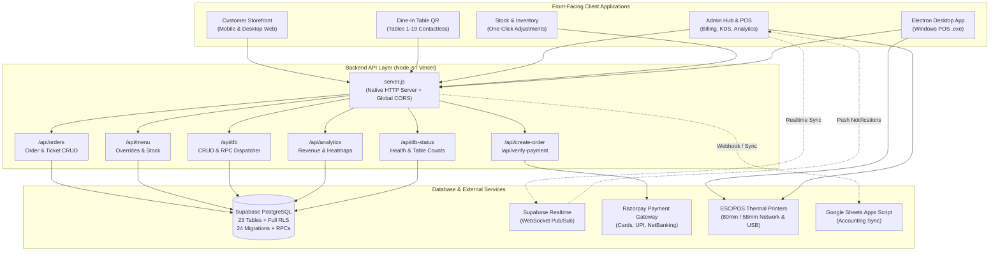

# 🍽️ LIMRA Restaurant — Enterprise Food Service, POS & E-Commerce Platform

[]()
[]()
[-3ECF8E.svg)]()
[]()
[]()
[-0B61A4.svg)]()
[]()

> **Owner / Operator:** SK Arif | LIMRA Restaurant, Egra, Purba Medinipur, West Bengal, India  
> **Database Host:** Supabase PostgreSQL (`https://ynrtlcasbndkrqeotgzt.supabase.co`)  
> **Desktop Client:** Electron 44 Windows Native POS Executable  

---

## 📑 Table of Contents

- [Executive Summary](#-executive-summary)
- [System Architecture](#-system-architecture)
- [Core Portals & Modules](#-core-portals--modules)
  - [1. Customer Web Storefront](#1-customer-web-storefront-frontendindexhtml)
  - [2. Dine-In Table QR Ordering](#2-dine-in-table-qr-ordering-frontendtableindexhtml)
  - [3. Admin Kitchen Operations & POS Billing Hub](#3-admin-kitchen-operations--pos-billing-hub-frontendadminhtml)
  - [4. Stock & Inventory Management](#4-stock--inventory-management-frontendstock-managerindexhtml)
  - [5. Electron Desktop POS & Hardware Printing](#5-electron-desktop-pos--hardware-printing-electron)
  - [6. Google Sheets Accounting Integration](#6-google-sheets-accounting-integration-toolsgoogle-apps-script)
- [🗂️ Project Directory Structure](#️-project-directory-structure)
- [🔌 REST API Reference](#-rest-api-reference)
- [🗄️ Database Schema & RPC Suite (23 Tables)](#️-database-schema--rpc-suite-23-tables)
- [⚡ Quick Start & Development](#-quick-start--development)
- [🔐 Environment Variables](#-environment-variables)
- [🛡️ Security, Performance & Recent Refactor Highlights](#️-security-performance--recent-refactor-highlights)
- [🖨️ Thermal Printer & ESC/POS Setup](#️-thermal-printer--escpos-setup)
- [🏗️ Build, Packaging & Deployment](#️-build-packaging--deployment)
- [📄 License & Proprietary Rights](#-license--proprietary-rights)

---

## 📖 Executive Summary

**LIMRA Restaurant** is a production-grade enterprise operating system and digital commerce platform tailored for high-volume modern food service. It seamlessly unites online food delivery, contactless table-side QR ordering, cashier billing counter (POS), kitchen order display (KDS), thermal receipt printing (ESC/POS), multi-warehouse inventory tracking, and real-time revenue analytics.

Built on **Vite 6**, **Tailwind CSS**, a native **Node.js** backend, and **Supabase PostgreSQL** with full Row Level Security (RLS), the platform is optimized for sub-second response times, ultra-low cloud egress, offline resilience, and cross-device responsiveness.

---

## 🏛️ System Architecture



---

## 🚀 Core Portals & Modules

### 1. Customer Web Storefront (`frontend/index.html`)
* **202-Dish Dynamic Menu:** Loaded from [`frontend/src/data/menu.js`](file:///c:/MY_ALL_ITEM/my%20all%20app/E-COMMERSE%20LIMRA%20website/frontend/src/data/menu.js) with real-time price and availability overrides from `menu_overrides`.
* **Category Filtering & Search:** Instant filtering across Indian, Biryani, Chinese, Tandoor, Desserts, and Beverages, with dietary badges (Veg, Non-Veg, Spicy, Chef's Special).
* **Delivery Geofencing with Leaflet.js:** Real-time customer GPS coordinate validation against defined polygon zones in the `delivery_areas` table with automated delivery fee calculations.
* **Shopping Cart & Checkout:** Persistent cart state in `localStorage`, customizable order notes, minimum order thresholds, and coupon code application.
* **Payment Integration:** Razorpay payment modal with signature verification or Cash on Delivery (COD).
* **Live Order Tracking:** Phone-based tracking showing order progression from *Pending* -> *Confirmed* -> *Preparing* -> *Out for Delivery* -> *Delivered*.
* **Table & Event Reservations:** Contactless booking engine (`place_booking` RPC) writing to the `bookings` table.
* **Internationalization (i18n):** Multi-language engine supporting **English (EN)**, **Bengali (BN)**, **Hindi (HI)**, and **Odia (OD)**.
* **Customer Review System:** Dynamic star rating and feedback submission stored in the `reviews` table.

### 2. Dine-In Table QR Ordering (`frontend/table/index.html`)
* **Contactless QR Access:** Pre-generated table QR tokens for Tables 1 to 19 supporting distinct restaurant zones (`indoor`, `outdoor`, `rooftop`).
* **Multi-Round Table Ordering (`place_table_round` RPC):** Customers can place multiple ordering rounds (appetizers first, main course later, desserts) accumulating under a single table ticket.
* **Ticket Lifecycle Tracking:** Real-time ticket statuses (`OPEN` -> `HOLD` -> `BILLED` -> `PAID` -> `CLOSED` / `CANCELLED`).
* **Dynamic Cross-Selling System:** Smart recommendations displayed during ordering to recommend complimentary beverages and sides based on current round selections.
* **Digital Service Signals:** Instant "Request Bill" and "Call Waiter" actions routed straight to staff dashboards.
* **QR Management Hub (`frontend/table/qr-admin.html`):** Staff portal to generate, customize, preview, and print table QR tokens.

### 3. Admin Kitchen Operations & POS Billing Hub (`frontend/admin.html`)
* **Warm Amber & Charcoal Theme:** Clean, modern restaurant aesthetic with responsive layout for smartphones, tablets, laptops, and wide touch POS terminals.
* **Clean Split Sidebar:** Quick navigation between Live Orders, POS Billing Counter, Menu Management, Reservation Bookings, Customer Directory, Inventory, Reports & Analytics, and Printer Settings.
* **Realtime WebSocket Stream:** Supabase Realtime listeners (`postgres_changes`) trigger instant visual cards and audio bell alerts for incoming orders.
* **Adaptive Polling Egress Optimization:** Fallback polling automatically uses exponential backoff and decay during idle periods, slashing log ingestion and egress by >80-95%.
* **POS Billing Counter:** Fast order entry for walk-in and phone customers, line-item discounts, split payments, and payment mode assignment (Cash, UPI, Card).
* **Kitchen Order Ticket (KOT) Display:** Dedicated kitchen order status progression (`pending` -> `confirmed` -> `preparing` -> `ready` -> `delivered`).
* **Thermal Receipt Printing:** ESC/POS printing engine with review QR code printing on customer bills.
* **Interactive Analytics:** Chart.js revenue charts, hourly heatmaps, order-type distribution, and top-selling items.

### 4. Stock & Inventory Management (Integrated in POS: `frontend/admin.html#panel-stock`)
* **Housed Inside POS:** Fully consolidated into the Admin Hub (`panel-stock`), eliminating redundant standalone pages.
* **One-Click Quick Presets:** Fast stock replenishment and adjustments (`+5`, `+10`, `-1`, `-5`) directly from the item card.
* **Low-Stock Visual Indicators:** Color-coded badges and alerts when ingredients fall below defined threshold levels.
* **Purchase Cost Tracking:** Supplier recording, purchase price logging, unit cost economics, and profit margin analysis.
* **Transactional Audit Trail:** Full logging across `stock_items`, `stock_in`, `stock_out`, `stock_in_entries`, and `stock_out_entries`.
* **Database RPCs:** Direct integration with `record_stock_in`, `record_stock_out`, and `get_stock_daily_summary`.
* **Complete English UI:** Clean, polished, user-friendly interface.

### 5. Electron Desktop POS & Hardware Printing (`electron/`)
* **Standalone Windows Desktop App:** Packaged executable (`.exe`) created via `electron-builder` with custom branding and icons.
* **Native Thermal Printing:** Direct ESC/POS hardware printing to 80mm and 58mm thermal receipt printers without browser print dialog interruptions.
* **Kiosk POS Mode:** Cashier mode with window lock and fullscreen capability.

### 6. Google Sheets Accounting Integration (`tools/google-apps-script/`)
* **Automated Ledger Sync:** Automated Google Apps Script ([`Code.gs`](file:///c:/MY_ALL_ITEM/my%20all%20app/E-COMMERSE%20LIMRA%20website/tools/google-apps-script/Code.gs)) that records incoming orders, item breakdowns, customer details, and payment statuses directly into Google Sheets for accounting and daily tally reconciliation.

---

## 🗂️ Project Directory Structure

```
E-COMMERSE LIMRA website/
│
├── 📁 backend/                          # Node.js REST API & Server
│   ├── api/                             # API Route Handlers
│   │   ├── lib/
│   │   │   └── supabase.js              # Supabase server-side client & ping
│   │   ├── analytics.js                 # GET    /api/analytics
│   │   ├── create-order.js              # POST   /api/create-order (Razorpay)
│   │   ├── db-status.js                 # GET    /api/db-status
│   │   ├── db.js                        # CRUD   /api/db (Generic CRUD & RPC)
│   │   ├── menu.js                      # GET/POST/PATCH /api/menu
│   │   ├── orders.js                    # GET/POST/PATCH/DELETE /api/orders
│   │   └── verify-payment.js            # POST   /api/verify-payment (HMAC)
│   ├── .env                             # Backend private environment
│   ├── .env.example                     # Environment template
│   ├── package.json                     # Backend dependencies
│   └── server.js                        # Native HTTP server + global CORS + static serving
│
├── 📁 frontend/                         # Vite 6 Multi-Page Application
│   ├── public/                          # Static assets served directly
│   │   ├── images/
│   │   │   └── qr/                      # Pre-generated table QR codes (1-19)
│   │   ├── media/
│   │   │   ├── items/                   # High-res item images (1.jpg - 202.jpg)
│   │   │   └── menu/                    # Physical menu card scans
│   │   ├── vendor/                      # Leaflet & Lucide icon assets
│   │   ├── favicon.ico                  # Browser favicon
│   │   ├── robots.txt                   # Search crawler directives
│   │   └── sitemap.xml                  # SEO sitemap
│   ├── src/                             # Application source code
│   │   ├── data/
│   │   │   └── menu.js                  # Master 202-dish menu catalog
│   │   ├── lib/
│   │   │   ├── admin-routes.js          # Admin route security guards
│   │   │   ├── email-service.js         # Order email notification services
│   │   │   ├── escpos.js                # ESC/POS thermal printer driver
│   │   │   ├── i18n.js                  # Internationalization (EN, BN, HI, OD)
│   │   │   ├── insforge.js              # Backward-compatibility re-export
│   │   │   ├── notifications.js         # Push notification helpers
│   │   │   ├── payments.js              # Razorpay checkout modal helpers
│   │   │   ├── print-queue.js           # Thermal print job queue manager
│   │   │   └── supabase.js              # Supabase frontend client & helpers
│   │   ├── stock-manager/               # Stock management modules
│   │   │   ├── data/initialStockData.js # Baseline inventory seed data
│   │   │   ├── stock-inpage.css         # Stock in/out modal styling
│   │   │   ├── stock-manager.css        # Stock manager core styling
│   │   │   └── stock-manager.js         # Inventory controller logic
│   │   ├── table/
│   │   │   └── table.js                 # Dine-in QR ordering & cross-selling
│   │   ├── admin-login.js               # Admin authentication handler
│   │   ├── admin-stock.js               # Quick stock bridges for POS
│   │   ├── admin.css                    # Admin & POS master stylesheet
│   │   ├── admin.js                     # POS, KDS & analytics master controller
│   │   ├── main.js                      # Customer storefront master controller
│   │   └── style.css                    # Storefront master stylesheet
│   ├── table/
│   │   ├── index.html                   # Dine-in table ordering UI
│   │   └── qr-admin.html                # Table QR code admin generator
│   ├── admin-login.html                 # Admin portal login page
│   ├── admin.html                       # Admin & POS billing dashboard
│   ├── index.html                       # Customer storefront homepage
│   ├── privacy.html                     # Privacy policy & terms of service
│   ├── package.json                     # Frontend dependencies
│   └── vite.config.js                   # Vite 6 MPA configuration
│
├── 📁 electron/                         # Electron Desktop Application
│   ├── main.cjs                         # Electron main process (lifecycle & printing)
│   ├── preload.cjs                      # Secure IPC preload bridge
│   ├── icon.ico                         # Windows executable application icon
│   └── icon.png                         # Desktop application icon
│
├── 📁 database/                         # Database Architecture
│   ├── schema.sql                       # Complete Supabase PostgreSQL schema (23 tables)
│   └── migrations/                      # 24 chronological SQL migration files
│
├── 📁 tools/                            # Developer Tools & Integrations
│   └── google-apps-script/
│       └── Code.gs                      # Google Sheets real-time order sync
│
├── 📁 scripts/                          # Build & Development Utilities
│   ├── generate-menu.mjs                # Menu data builder
│   ├── generate-table-qr.mjs            # QR code batch generation script
│   └── run-dev.mjs                      # Orchestrated frontend + backend dev runner
│
├── .env                                 # Root environment variables
├── .env.example                         # Root environment template
├── .gitignore                           # Git ignore rules
├── capacitor.config.json                # Capacitor Android configuration
├── package.json                         # Root monorepo workspace configuration
└── vercel.json                          # Vercel serverless deployment routing
```

---

## 🔌 REST API Reference

All backend endpoints are hosted under `/api/*`. Global CORS, header management, and JSON body parsing are handled centrally in [`backend/server.js`](file:///c:/MY_ALL_ITEM/my%20all%20app/E-COMMERSE%20LIMRA%20website/backend/server.js).

| Method | Endpoint | Description | Key Parameters / Body |
|---|---|---|---|
| `GET` | `/api/orders` | Query and filter orders | `id`, `order_number`, `status`, `phone`, `date_from`, `date_to`, `order_type`, `limit` |
| `POST` | `/api/orders` | Place delivery or dine-in order | `{ customerName, customerPhone, items, orderType, tableNumber, tableZone, notes, txnRef }` |
| `PATCH` | `/api/orders` | Update order/ticket status | `{ id, order_number, status, ticket_status, payment_status, table_number }` |
| `DELETE` | `/api/orders` | Cancel / delete order | Query/Body `{ id, order_number }` |
| `POST` | `/api/create-order` | Create Razorpay payment order | `{ amount (paise), currency: "INR", receipt }` |
| `POST` | `/api/verify-payment` | Verify Razorpay HMAC signature | `{ razorpay_order_id, razorpay_payment_id, razorpay_signature }` |
| `GET` | `/api/menu` | Fetch active menu overrides | None |
| `POST` | `/api/menu` | Upsert item price / availability | `{ id, price, mrp, available, featured, description }` |
| `PATCH` | `/api/menu` | Quick-toggle item availability | `{ id, available, price, mrp, featured }` |
| `ALL` | `/api/db` | Generic Supabase CRUD & RPC dispatcher | `{ action, table, filter, data, updates, rpc, params }` |
| `GET` | `/api/db-status` | Database health ping & table counts | Returns connection latency and row counts for all 23 tables |
| `GET` | `/api/analytics` | Revenue & sales breakdown | Returns gross revenue, status counts, order types, and hourly heatmaps |

---

## 🗄️ Database Schema & RPC Suite (23 Tables)

Full schema definition: [`database/schema.sql`](file:///c:/MY_ALL_ITEM/my%20all%20app/E-COMMERSE%20LIMRA%20website/database/schema.sql)  
Migration history: [`database/migrations/`](file:///c:/MY_ALL_ITEM/my%20all%20app/E-COMMERSE%20LIMRA%20website/database/migrations/) (24 SQL migrations)

### 📊 PostgreSQL Tables Overview

| # | Table Name | Purpose | Key Attributes |
|:---:|---|---|---|
| 1 | `orders` | Master orders table (delivery, takeaway, dine-in) | `id`, `order_number`, `customer_name`, `customer_phone`, `total_amount`, `status`, `payment_status`, `order_type`, `table_number`, `ticket_status` |
| 2 | `order_items` | Line items attached to orders | `id`, `order_id`, `menu_item_id`, `item_name`, `quantity`, `unit_price`, `line_total` |
| 3 | `bookings` | Table & event reservation requests | `id`, `customer_name`, `customer_phone`, `booking_date`, `booking_time`, `guests`, `status` |
| 4 | `admin_users` | Staff & administrator credentials | `id`, `email`, `role`, `is_active`, `last_login` |
| 5 | `menu_overrides` | Dynamic prices & item availability | `id`, `price`, `mrp`, `available`, `featured`, `description` |
| 6 | `combos` | Bundled food offers & meal combos | `id`, `title`, `description`, `price`, `item_ids`, `active` |
| 7 | `coupons` | Promotional discount rules | `id`, `code`, `discount_type`, `discount_value`, `min_order_amount`, `max_discount`, `valid_until` |
| 8 | `coupon_usage` | Coupon redemption history per customer | `id`, `coupon_id`, `customer_phone`, `order_id`, `used_at` |
| 9 | `delivery_areas` | Leaflet delivery geofencing polygons | `id`, `area_name`, `delivery_fee`, `polygon_coordinates`, `active` |
| 10 | `notifications` | Live staff & customer order alerts | `id`, `recipient_phone`, `title`, `message`, `type`, `read`, `order_id` |
| 11 | `printer_settings` | ESC/POS thermal printer hardware config | `id`, `printer_type`, `paper_width`, `ip_address`, `review_qr_url`, `auto_print` |
| 12 | `reviews` | Customer ratings & feedback | `id`, `customer_name`, `rating`, `comment`, `order_id`, `approved` |
| 13 | `customer_profiles` | Customer registry and preferences | `id`, `phone`, `name`, `email`, `default_address`, `total_orders`, `total_spent` |
| 14 | `phone_verifications` | SMS / OTP verification records | `id`, `phone`, `otp_hash`, `verified`, `expires_at` |
| 15 | `verified_payments` | Verified Razorpay transactions | `id`, `utr`, `amount`, `status`, `created_at` |
| 16 | `payment_history` | Complete payment audit log | `id`, `order_id`, `payment_method`, `amount`, `txn_ref`, `status` |
| 17 | `security_audit_logs`| Security access & anomaly audit trail | `id`, `event_type`, `severity`, `details`, `ip_address`, `user_id` |
| 18 | `stock_items` | Master inventory items and quantities | `id`, `name`, `unit`, `qty`, `min_threshold`, `cost_price`, `selling_price`, `category` |
| 19 | `stock_in` | Master stock receipt batches | `id`, `supplier_name`, `invoice_number`, `total_cost`, `received_at` |
| 20 | `stock_out` | Master manual stock reduction batches | `id`, `reason`, `authorized_by`, `dispatched_at` |
| 21 | `stock_logs` | Audit log of all inventory movements | `id`, `stock_item_id`, `action`, `quantity_change`, `details`, `created_at` |
| 22 | `stock_in_entries` | Line items for stock receipts | `id`, `stock_in_id`, `stock_item_id`, `quantity`, `unit_cost`, `line_total` |
| 23 | `stock_out_entries`| Line items for manual stock deductions | `id`, `stock_out_id`, `stock_item_id`, `quantity`, `reason` |

### ⚙️ Core Stored Procedures & Functions (RPCs)

* **`place_order(...)`**: Atomic order creation with price checks, item insertion, inventory verification, and staff notification triggering.
* **`place_table_round(...)`**: Multi-round table ordering routine. Appends new round items to existing `OPEN` tickets or initializes a new ticket for the table.
* **`place_booking(...)`**: Atomic reservation booking submission.
* **`check_ticket_not_closed()`**: Database trigger preventing line items from being added to tickets marked `CLOSED` or `CANCELLED`.
* **`record_stock_in(...)` & `record_stock_out(...)`**: Transactional stock adjustments with entry tracking and log creation.
* **`get_stock_daily_summary(...)`**: Aggregates daily stock usage, costs, and current levels.
* **`create_notification(...)`, `get_customer_notifications(...)`, `mark_all_notifications_as_read(...)`**: Real-time notification suite.
* **`verify_upi_payment(...)`**: Confirms verified payment tokens and updates order payment statuses.

---

## ⚡ Quick Start & Development

### Prerequisites
- **Node.js**: v20.x or higher
- **npm**: v10.x or higher
- **Supabase Account**: with project initialized

### 1. Installation

```bash
# Clone the repository
git clone <repo-url>
cd "E-COMMERSE LIMRA website"

# Install monorepo dependencies
npm install
```

### 2. Environment Setup

Copy `.env.example` to `.env` in the root:

```bash
cp .env.example .env
```

Ensure your `.env` contains valid credentials:

```env
SUPABASE_URL=https://your-project.supabase.co
SUPABASE_ANON_KEY=your-anon-key
SUPABASE_SERVICE_ROLE_KEY=your-service-role-key

RAZORPAY_KEY_ID=rzp_live_xxxxxxxxxxxx
RAZORPAY_KEY_SECRET=your-razorpay-secret

PORT=3000
```

Also configure `frontend/.env`:

```env
VITE_SUPABASE_URL=https://your-project.supabase.co
VITE_SUPABASE_ANON_KEY=your-anon-key
VITE_SUPABASE_PUBLISHABLE_KEY=your-anon-key
VITE_RAZORPAY_KEY_ID=rzp_live_xxxxxxxxxxxx
```

### 3. Launch Development Server

Run both frontend and backend concurrently with a single command:

```bash
npm run dev
```

### 🌐 Local Access URLs

| Portal | URL | Description |
|---|---|---|
| **Customer Storefront** | [`http://localhost:5173/`](http://localhost:5173/) | Online ordering, live tracking & booking |
| **Admin Login** | [`http://localhost:5173/admin-login.html`](http://localhost:5173/admin-login.html) | Secure authentication portal |
| **Admin Hub & POS** | [`http://localhost:5173/admin.html`](http://localhost:5173/admin.html) | Live kitchen KDS, POS counter & analytics |
| **Stock Manager (POS)** | [`http://localhost:5173/admin.html#panel-stock`](http://localhost:5173/admin.html#panel-stock) | Integrated inventory control, 1-click presets |
| **Dine-In Table 1 QR** | [`http://localhost:5173/table/index.html?table=1`](http://localhost:5173/table/index.html?table=1) | Digital QR menu for Table 1 |
| **QR Code Admin** | [`http://localhost:5173/table/qr-admin.html`](http://localhost:5173/table/qr-admin.html) | Batch table QR token generator |
| **Backend API Server** | [`http://localhost:3000/api/db-status`](http://localhost:3000/api/db-status) | Health check & 23-table status |

---

## 🔐 Environment Variables

| Variable | Scope | Description |
|---|---|---|
| `SUPABASE_URL` | Backend | Supabase project URL (`https://<project-ref>.supabase.co`) |
| `SUPABASE_ANON_KEY` | Backend | Public anonymous API key |
| `SUPABASE_SERVICE_ROLE_KEY` | Backend | Elevated admin service role key (Never expose to client!) |
| `PORT` | Backend | HTTP server listening port (Default: `3000`) |
| `RAZORPAY_KEY_ID` | Backend / Frontend | Razorpay Key ID (`rzp_live_...` or `rzp_test_...`) |
| `RAZORPAY_KEY_SECRET` | Backend Only | Razorpay Secret for HMAC-SHA256 signature verification |
| `VITE_SUPABASE_URL` | Frontend | Client-facing Supabase URL |
| `VITE_SUPABASE_ANON_KEY` | Frontend | Client-facing Supabase Anon Key |
| `VITE_SUPABASE_PUBLISHABLE_KEY` | Frontend | Client-facing publishable key |
| `VITE_RAZORPAY_KEY_ID` | Frontend | Razorpay Key ID for client checkout modal |

---

## 🛡️ Security, Performance & Recent Refactor Highlights

### 🔒 Security Enhancements
- **Zero Hardcoded Secrets:** Stripped all hardcoded Razorpay secrets and Supabase dummy fallbacks from API code. All credentials are now strictly loaded from `.env`.
- **Key Validation Guards:** Payment creation (`/api/create-order`) and signature verification (`/api/verify-payment`) endpoints explicitly validate that required API keys exist before attempting requests, returning clear 500 error messages if unconfigured.
- **HMAC-SHA256 Signature Verification:** Razorpay payment verification executes exclusively on the server side using cryptographically secure HMAC hashing.
- **Row Level Security (RLS):** Enabled across all 23 database tables in Supabase with granular policies distinguishing public vs. admin access.
- **Ticket Immutability Trigger:** `check_ticket_not_closed` trigger prevents appending orders to tickets that have been closed or cancelled.

### ⚡ Performance & Synchronization
- **Supabase Realtime Pub/Sub:** Uses WebSocket channel listeners (`postgres_changes`) for real-time order notifications and kitchen display updates.
- **Adaptive Polling Decay:** Slashes database polling and egress by >80-95% by backing off query frequency when no orders are active.
- **Idempotent Inventory Deduction:** Exact match `.eq()` item checks combined with `stock_logs` transaction records guarantee that stock is never deducted twice for the same order.
- **Centralized Server Routing:** Redundant CORS and OPTIONS headers removed from individual API route handlers; unified global middleware in `server.js`.

### 🧹 Repository Cleanup
- **Over 140MB of Dead Artifacts Cleaned:** Removed stale build directories (`dist`, `build`, legacy `android/` build cache), duplicate root `api/` handlers, and unused scripts.
- **Organized Database & Tools Structure:** Co-located `database/schema.sql` and `database/migrations/` (24 migration files). Moved Google Apps Script integration to `tools/google-apps-script/`.

---

## 🖨️ Thermal Printer & ESC/POS Setup

The platform includes a native ESC/POS thermal printing engine ([`frontend/src/lib/escpos.js`](file:///c:/MY_ALL_ITEM/my%20all%20app/E-COMMERSE%20LIMRA%20website/frontend/src/lib/escpos.js) & [`frontend/src/lib/print-queue.js`](file:///c:/MY_ALL_ITEM/my%20all%20app/E-COMMERSE%20LIMRA%20website/frontend/src/lib/print-queue.js)):

* **Supported Paper Widths:** 80mm standard POS paper and 58mm compact receipts.
* **Customer Bill Printing:** Displays restaurant header, table/order number, itemized quantities, unit prices, subtotal, discounts, taxes, and final bill total.
* **Google Review QR Code:** Dynamically generates and prints a scannable Google Review QR code directly at the bottom of the bill (`printer_settings.review_qr_url`).
* **Kitchen Order Tickets (KOT):** Prints kitchen tickets with bold item names, modifications, order notes, and round numbers.
* **Desktop Direct Print:** When run inside the Electron app, receipts print directly to the default or configured hardware thermal printer without triggering browser dialogs.

---

## 🏗️ Build, Packaging & Deployment

```bash
# 1. Build Frontend MPA
npm run build

# 2. Run Backend Server in Production
npm run start

# 3. Launch Electron Desktop POS (Dev)
npm run desktop:dev

# 4. Package Windows .exe Desktop Installer
npm run desktop:dist

# 5. Sync Capacitor Android Project
npm run cap:sync
```

### Deployment Targets
- **Vercel / Cloud Platforms:** The repository includes [`vercel.json`](file:///c:/MY_ALL_ITEM/my%20all%20app/E-COMMERSE%20LIMRA%20website/vercel.json) for zero-config serverless API deployment with static asset hosting.
- **Self-Hosted VPS (Node.js + Nginx):** Run `npm run build` followed by `npm run start` behind an Nginx reverse proxy.
- **POS Terminals:** Install the generated `.exe` from `release/` on any Windows POS machine.

---

## 📄 License & Proprietary Rights

**Private & Proprietary** — © 2025-2026 **SK Arif / LIMRA Restaurant**. All rights reserved.  
Unauthorized copying, modification, distribution, or commercial use of this software without prior written permission is strictly prohibited.
